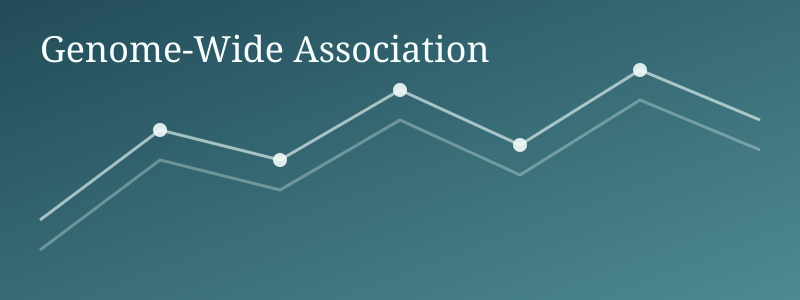
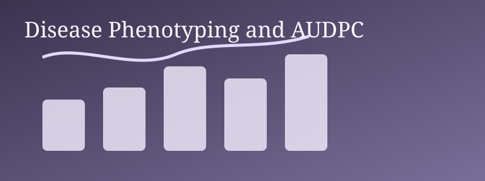
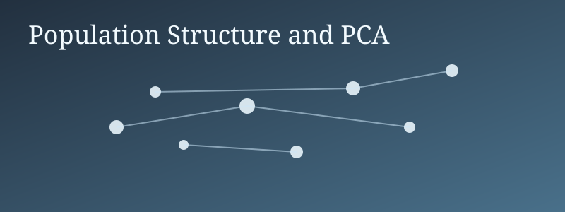

A curated set of research and data projects.

## Featured Projects

::: {.project-grid}

### Genome-Wide Association in Quinoa

Association mapping workflow using filtered variants, covariates, and model diagnostics.

<a class="project-tag-link" href="https://scholar.google.com/scholar?q=GWAS" target="_blank" rel="noopener noreferrer" onclick="event.stopPropagation();">GWAS</a>
<a class="project-tag-link" href="https://scholar.google.com/scholar?q=Quinoa" target="_blank" rel="noopener noreferrer" onclick="event.stopPropagation();">Quinoa</a>
<a class="project-tag-link" href="https://scholar.google.com/scholar?q=Genomics" target="_blank" rel="noopener noreferrer" onclick="event.stopPropagation();">Genomics</a>

### Disease Phenotyping and AUDPC Analysis

Phenotype harmonization, replicate handling, BLUP estimation, and disease summary plots.

<a class="project-tag-link" href="https://scholar.google.com/scholar?q=AUDPC" target="_blank" rel="noopener noreferrer" onclick="event.stopPropagation();">AUDPC</a>
<a class="project-tag-link" href="https://scholar.google.com/scholar?q=BLUP" target="_blank" rel="noopener noreferrer" onclick="event.stopPropagation();">BLUP</a>
<a class="project-tag-link" href="https://scholar.google.com/scholar?q=Phenotypes" target="_blank" rel="noopener noreferrer" onclick="event.stopPropagation();">Phenotypes</a>

### Population Structure and PCA Workflow

Variant quality control and principal component analysis for population structure inference.

<a class="project-tag-link" href="https://scholar.google.com/scholar?q=PCA" target="_blank" rel="noopener noreferrer" onclick="event.stopPropagation();">PCA</a>
<a class="project-tag-link" href="https://scholar.google.com/scholar?q=Population+Genomics" target="_blank" rel="noopener noreferrer" onclick="event.stopPropagation();">Population Genomics</a>
<a class="project-tag-link" href="https://scholar.google.com/scholar?q=QC" target="_blank" rel="noopener noreferrer" onclick="event.stopPropagation();">QC</a>

:::

## Add a New Project

1. Create a new `.qmd` file in `projects/`.
2. Copy one project card block and update title, description, tags, and link.
3. Commit and push to `main`.
